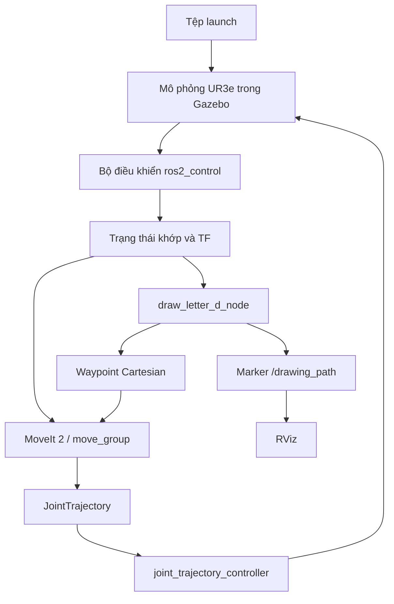

# Vẽ chữ D bằng Cartesian (tọa độ Descartes) với ROS 2 và MoveIt 2

**Tương tác Người–Robot — Bài thực hành 01**
Điều khiển robot UR3e viết chữ **D** trong Gazebo bằng ROS 2 Humble và MoveIt 2.

Chữ D là chữ cái đầu trong tên **Dũng**. Gói phần mềm này minh họa cách xây dựng
các `waypoint` (điểm mốc), lập kế hoạch chuyển động bằng MoveIt 2 và thực thi
`trajectory` (quỹ đạo) thông qua `joint_trajectory_controller` (bộ điều khiển
quỹ đạo khớp).

## 1. Mục tiêu

Mục tiêu của bài là làm quen với chuỗi xử lý điều khiển robot công nghiệp:

- mô phỏng UR3e trong Gazebo Fortress;
- nhận trạng thái khớp và TF từ môi trường mô phỏng;
- dùng MoveIt 2 để giải `inverse kinematics` (động học ngược), lập kế hoạch
  chuyển động và `collision checking` (kiểm tra va chạm);
- chuyển các waypoint Cartesian của chữ D thành quỹ đạo khớp;
- quan sát robot và đường đi của TCP trong RViz.

Robot thực hiện một lần theo trình tự:

```text
READY → HOVER → PEN DOWN → LETTER D → PEN UP
```

## 2. Kiến trúc hệ thống



`draw_letter_d.launch.py` khởi động môi trường mô phỏng, bộ điều khiển, MoveIt,
RViz và nút vẽ theo đúng thứ tự phụ thuộc. Phần `controller recovery` (khôi
phục bộ điều khiển) chờ `joint_state_broadcaster` và
`joint_trajectory_controller` ở trạng thái `active` trước khi cho nút bắt đầu
lập kế hoạch.

## 3. Trình tự chuyển động

| Trạng thái | Ý nghĩa |
|---|---|
| `READY` | Phần khôi phục giữ robot ở tư thế khởi động an toàn. |
| `HOVER` | MoveIt giải IK và lập kế hoạch trong `joint-space` (không gian khớp) đến phía trên điểm bắt đầu. |
| `PEN DOWN` | TCP hạ xuống mặt phẳng viết bằng `Cartesian path` (đường đi Cartesian). |
| `LETTER D` | TCP đi theo toàn bộ waypoint của chữ D. |
| `PEN UP` | TCP nhấc lên khỏi mặt phẳng sau khi viết xong. |

`HOVER` dùng `pose planning` (lập kế hoạch theo tư thế) để tiếp cận. Ba đoạn
còn lại dùng `Cartesian path` để TCP bám trực tiếp theo mặt phẳng và hình dạng chữ.

## 4. Tạo hình học chữ D

Chữ D được vẽ trong `frame` (hệ tọa độ) `world`, trên mặt phẳng XZ với tọa độ Y
cố định.

Các thông số hình học hiện tại là `center_x = 0.12 m`, `bottom_z = 0.55 m`,
`height = 0.12 m`, `width = 0.08 m` và `plane_y = 0.221 m`.

TCP giữ hướng cố định trong khi viết. Chữ gồm một đoạn
thẳng từ chân phải lên đỉnh phải, sau đó là nửa elip quay về chân phải.

Các điểm trên cung cong được nội suy theo:

```text
x(theta) = x_right - width * cos(theta)
z(theta) = bottom_z + height / 2
           + height / 2 * sin(theta)
```

Waypoint chỉ thay đổi X và Z; Y giữ nguyên bằng `plane_y`, nên đường đi
Cartesian nằm trên cùng một mặt phẳng trong suốt quá trình viết.

## 5. Lập kế hoạch và an toàn với MoveIt 2

MoveIt 2 nhận `pose` (tư thế) và waypoint, giải động học ngược rồi tạo
`JointTrajectory` cho bộ điều khiển. Gói phần mềm áp dụng các điều kiện sau:

- `HOVER` dùng lập kế hoạch theo tư thế; `PEN DOWN`, `LETTER D` và `PEN UP` dùng
  `computeCartesianPath()`;
- bật kiểm tra va chạm khi tính đường đi Cartesian;
- `Cartesian fraction` (tỷ lệ hoàn thành đường đi) phải đạt `1.0` trước khi thực thi;
- `relative jump threshold` (ngưỡng nhảy tương đối) của MoveIt được truyền bằng `0.0`;
- `max_absolute_joint_step = 0.5 rad` giới hạn bước nhảy khớp tuyệt đối;
- `velocity_scaling = 0.05` và `acceleration_scaling = 0.05` giới hạn vận tốc và gia tốc;
- `trajectory tolerance = 0.30 rad` (dung sai quỹ đạo) giúp bộ điều khiển ổn định trong Gazebo;
- nghiệm IK của HOVER được đưa về gần trạng thái khớp hiện tại để tránh một khớp đi vòng thêm `2π`.

| Tham số | Mặc định | Ý nghĩa |
|---|---:|---|
| `plane_y` | `0.221 m` | Vị trí mặt phẳng viết theo trục Y. |
| `center_x` | `0.12 m` | Tọa độ X tại tâm chữ. |
| `bottom_z` | `0.55 m` | Độ cao đáy chữ. |
| `letter_height` | `0.12 m` | Chiều cao chữ D. |
| `letter_width` | `0.08 m` | Chiều rộng chữ D. |
| `lift_distance` | `0.05 m` | Khoảng TCP được nâng trước và sau khi viết. |
| `eef_step` | `0.005 m` | Bước lấy mẫu Cartesian, tương đương 5 mm. |
| `max_absolute_joint_step` | `0.5 rad` | Giới hạn bước nhảy khớp tuyệt đối. |
| `velocity / acceleration scaling` | `0.05` | Hệ số giới hạn vận tốc và gia tốc của MoveIt. |

## 6. Cấu trúc gói phần mềm

```text
ur3_draw_letter/
├── CMakeLists.txt
├── package.xml
├── LICENSE
├── README.md
├── config/
│   ├── draw_letter.rviz
│   └── ur_controllers_assignment.yaml
├── docs/images/
│   └── .gitkeep
├── include/ur3_draw_letter/
│   └── letter_geometry.hpp
├── launch/
│   └── draw_letter_d.launch.py
├── scripts/
│   └── validate_runtime.sh
├── src/
│   └── draw_letter_d_node.cpp
└── test/
    └── test_letter_geometry.cpp
```

- `launch/draw_letter_d.launch.py`: khởi động toàn bộ hệ thống.
- `src/draw_letter_d_node.cpp`: lập kế hoạch, thực thi chuyển động bằng MoveIt và xuất marker TCP.
- `include/.../letter_geometry.hpp`: sinh waypoint hình học của chữ D.
- `config/ur_controllers_assignment.yaml`: cấu hình bộ điều khiển mô phỏng.
- `config/draw_letter.rviz`: cấu hình Fixed Frame, RobotModel, MoveIt và Marker.
- `scripts/validate_runtime.sh`: kiểm tra hệ thống khi đang chạy.
- `test/test_letter_geometry.cpp`: kiểm tra mặt phẳng và kích thước waypoint.

## 7. Yêu cầu cài đặt

- Ubuntu 22.04 hoặc WSL2 Ubuntu 22.04 có hỗ trợ giao diện đồ họa;
- ROS 2 Humble Desktop;
- MoveIt 2;
- Gazebo Fortress;
- `ur_description`, `ur_moveit_config` và `ur_simulation_gz`.

Mô phỏng không cần robot UR thật và không cần chạy Universal Robots ROS Driver.
Các gói UR cần được cài theo tài liệu chính thức trước khi xây dựng.

## 8. Xây dựng gói

Ví dụ sao chép gói vào một workspace ROS 2 mới:

```bash
mkdir -p ~/ros2_ws/src
cd ~/ros2_ws/src
git clone https://github.com/kieudung12/HRI_b1.git ur3_draw_letter

cd ~/ros2_ws
source /opt/ros/humble/setup.bash

rosdep install --from-paths src \
  --ignore-src -r -y --rosdistro humble

colcon build \
  --packages-select ur3_draw_letter \
  --symlink-install

source install/setup.bash
```

## 9. Chạy chương trình

Khởi chạy mô phỏng, Gazebo, RViz và nút viết chữ:

```bash
cd ~/ros2_ws
source /opt/ros/humble/setup.bash
source install/setup.bash

ros2 launch ur3_draw_letter draw_letter_d.launch.py
```

Chạy `headless` (không mở giao diện đồ họa) để kiểm tra trên cửa sổ dòng lệnh:

```bash
ros2 launch ur3_draw_letter draw_letter_d.launch.py \
  draw_gazebo_gui:=false draw_rviz:=false
```

Các `launch argument` (tham số khởi chạy):

| Tham số | Mặc định | Ý nghĩa |
|---|---|---|
| `ur_type` | `ur3e` | Loại robot Universal Robots. |
| `draw_gazebo_gui` | `true` | Bật hoặc tắt cửa sổ Gazebo. |
| `draw_rviz` | `true` | Bật hoặc tắt RViz. |
| `draw_node` | `true` | Bật hoặc tắt nút viết chữ. |
| `ign_partition` | `ur3_draw_letter` | Không gian Gazebo riêng cho gói. |

Chỉ nên chạy một launch Gazebo tại một thời điểm để tránh trùng `/clock` và
`/controller_manager`.

## 10. Kiểm tra hoạt động

Sau khi chương trình đã chạy, mở một cửa sổ dòng lệnh khác:

```bash
cd ~/ros2_ws/src/ur3_draw_letter
./scripts/validate_runtime.sh
```

Có thể kiểm tra thủ công:

```bash
source /opt/ros/humble/setup.bash
source ~/ros2_ws/install/setup.bash

ros2 control list_controllers
ros2 topic echo /joint_states --once
ros2 topic info /drawing_path
ros2 topic info /clock
```

Trạng thái bộ điều khiển cần đạt:

```text
joint_trajectory_controller   active
joint_state_broadcaster       active
```

Các thông báo chính mong đợi:

```text
READY: controller recovery hold da thanh cong.
HOVER plan: SUCCESS
PEN DOWN Cartesian fraction: 100.0%
LETTER D Cartesian fraction: 100.0%
LETTER D: execution thanh cong.
PEN UP: execution thanh cong.
Hoan tat chu D mot lan.
```

## 11. Kết quả

- Video kết quả: <https://drive.google.com/file/d/1jdoLBA7VriOajd2HTTnhO_-BGdYgKXFS/view?usp=sharing>
- Kho mã nguồn trên GitHub: <https://github.com/kieudung12/HRI_b1>


## 12. Tài liệu tham khảo

- [ROS 2 Humble](https://docs.ros.org/en/humble/)
- [Mô phỏng Gazebo cho Universal Robots](https://github.com/UniversalRobots/Universal_Robots_ROS2_GZ_Simulation)
- [Universal Robots ROS Driver](https://github.com/UniversalRobots/Universal_Robots_ROS_Driver)
- [Ví dụ MoveIt 2 cho Universal Robots](https://github.com/dominikbelter/ros2_ur_moveit_examples)
